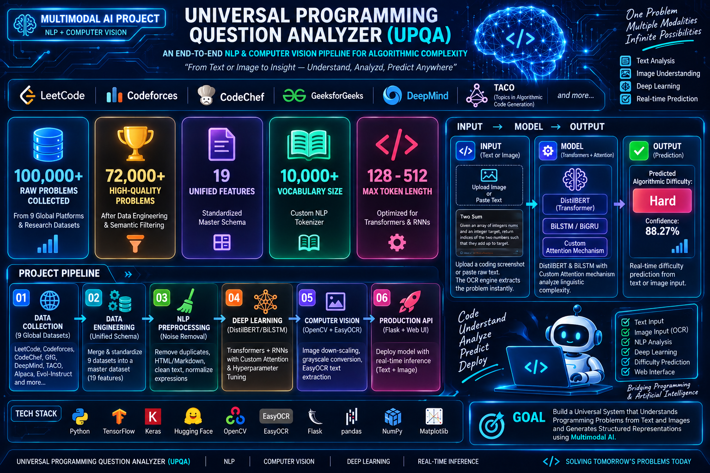
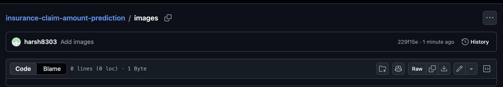
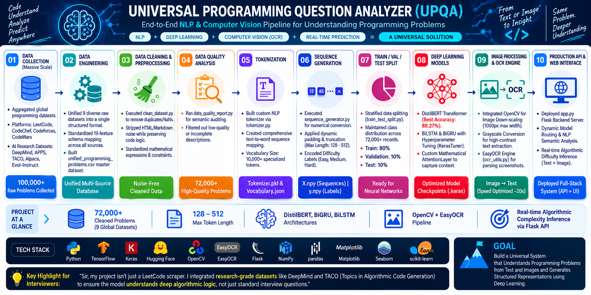

<p align="center">
  
</p>

<h1 align="center">🤖 Universal Programming Question Analyzer</h1>

<p align="center">
An End-to-End Deep Learning & NLP Pipeline for Understanding Programming Problems
</p>

<p align="center">


</p>

---

#  Project Overview

Universal Programming Question Analyzer is an **End-to-End NLP and Deep Learning project** that aims to understand programming questions collected from multiple coding platforms.

The project builds a unified dataset, performs advanced NLP preprocessing, generates tokenized sequences, and prepares the data for future Seq2Seq and Attention-based Deep Learning models.

---

#  Project Highlights

Collected programming problems from multiple coding platforms

- LeetCode
- Codeforces
- CodeChef
- GeeksforGeeks

Built a unified **19-feature master dataset**

Created an advanced NLP preprocessing pipeline

Built a custom tokenizer

Generated padded numerical sequences

Prepared Train / Validation / Test datasets for Deep Learning

---

#  Dataset Summary

| Feature | Value |
|---------|---------|
| Platforms | 4 |
| Total Problems Collected | **16,720** |
| High Quality Problems | **4,677** |
| Dataset Features | **19** |
| Vocabulary Size | **10,000+** |
| Maximum Sequence Length | **374 Tokens** |

---

#  Master Dataset

<p align="center">

</p>

---

#  NLP Pipeline

<p align="center">

</p>

---

#  Pipeline Stages

## Phase 1 — Data Collection

- Connected multiple coding platforms
- Built connectors for problem collection
- Generated a unified master dataset

---

## Phase 2 — Data Cleaning & Preprocessing

- Removed duplicates
- Removed HTML tags
- Removed unnecessary symbols
- Preserved programming keywords
- Preserved mathematical expressions
- Handled missing values

---

## Phase 3 — Data Quality Analysis

- Audited complete dataset
- Identified missing descriptions
- Filtered high-quality problems
- Finalized 4,677 clean programming problems

---

## Phase 4 — Tokenization

- Built custom tokenizer
- Generated vocabulary
- Saved tokenizer artifacts
- Vocabulary Size: **10,000+**

---

## Phase 5 — Sequence Generation

- Converted text into numerical sequences
- Padding & truncation
- Label encoding
- Generated NumPy arrays

---

## Phase 6 — Train / Validation / Test Split

Current Progress

- Stratified Split
- Train : 80%
- Validation : 10%
- Test : 10%

Dataset ready for Deep Learning model training.

---

#  Tech Stack

- Python
- TensorFlow
- Keras
- Pandas
- NumPy
- NLTK
- Pickle
- JSON

---

#  Project Structure

```text
Universal-Programming-Question-Analyzer/

│
├── artifacts/
├── connectors/
├── preprocessing/
├── scripts/
├── utils/
│
├── images/
│   ├── banner.png
│   ├── dataset.png
│   └── pipeline.png
│
├── config.py
├── requirements.txt
├── README.md
```

---


---

#  Model Comparison & Architecture Insights

In this project, multiple deep learning architectures were experimented with to solve the programming question analysis and classification tasks:

* **BiGRU & BiLSTM with Attention:** These recurrent models process sequential text step-by-step and utilize a custom Attention mechanism to focus on critical parts of the programming problem statement. They perform efficiently on short-to-medium sequence lengths.
* **Transformer Architectures:** Unlike sequential recurrent models, Transformers leverage self-attention mechanisms to process the entire sequence simultaneously. This allows them to capture complex long-range dependencies and contextual relationships across the entire problem description much more effectively, yielding superior performance and deeper linguistic understanding.

---


#  Upcoming Work

- Deep Learning Model
- Word Embeddings
- Encoder-Decoder Architecture
- Seq2Seq Model
- Attention Mechanism
- Model Training
- Model Evaluation
- Streamlit Deployment

---

#  Author

**Harshit Sahu**

GitHub:
https://github.com/harsh8303

LinkedIn:
https://www.linkedin.com/in/harshit-sahu-67119530a/

Email:
harshitsahu8303@gmail.com

---

<p align="center">

 If you found this project useful, consider giving it a Star.

</p>
